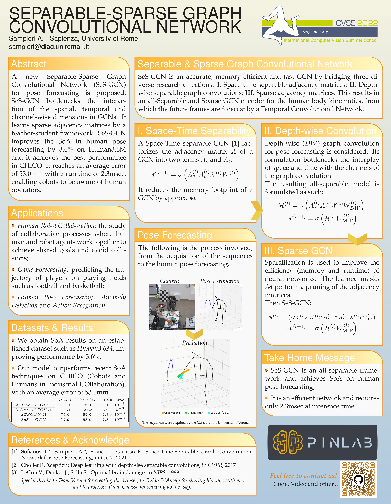

<h3 align="center">International Summer School on Computer Vision</h3>
<h1 align="center">Separable-Sparse Graph Convolutional Network</h1>

<h2 align="center">Abstract</h2> 

 

A new Separable-Sparse Graph Convolutional Network (SeS-GCN) for pose forecasting is proposed. SeS-GCN bottlenecks the interaction of the spatial, temporal and channel-wise dimensions in GCNs. It learns sparse adjacency matrices by a teacher-student framework. SeS-GCN improves the SoA in human pose forecasting by 3.6% on Human3.6M and it achieves the best performance in CHICO. It reaches an average error of 53.0mm with a run time of 2.3msec, enabling cobots to be aware of human operators.

The work is part of the paper <b>Pose Forecasting in Industrial Human-Robot Collaboration</b> which will be presented at the European Conference on Computer Vision 2022.
Thanks to Guido D'Amely, Andrea Avogaro, Geri Skenderi, Federico Cunico, prof. Marco Cristani and prof. Fabio Galasso.

<h3 align="center"> 
<b><c>Code will be released soon</s></c>
</h3>
